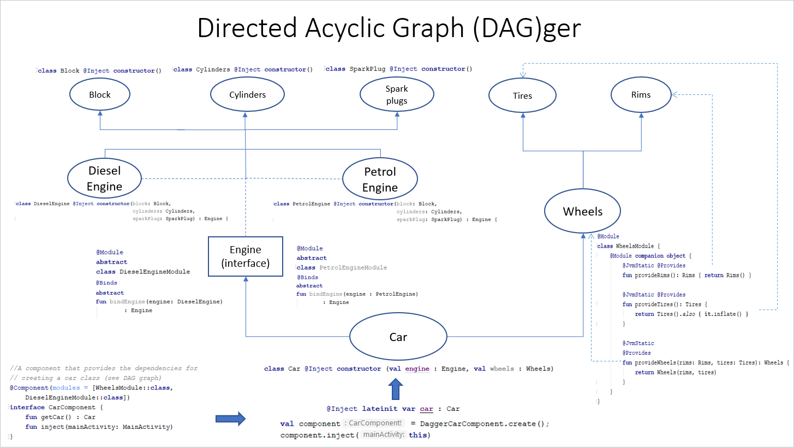

# Dagger2Example

 
 
A simple project building a car with its dependencies using Dagger2. This may be useful for those starting out with Dagger2 dependency injection as a learning tool.
 The included DAG helps visualise how a car and its dependencies are put together along side the code.
 
 
<b> Dagger Overview
 
@Module, @Binds and @Provides: define classes and methods which provide dependencies  
@Inject: request dependencies. Can be used on a constructor, a field, or a method  
@Component: enable selected modules and used for performing dependency injection  
  
